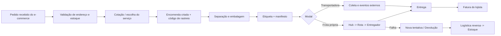
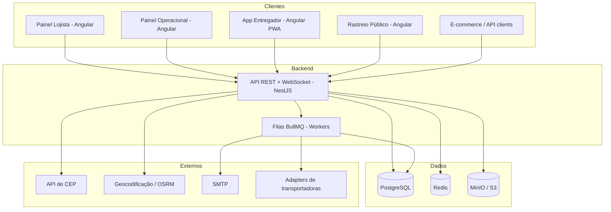
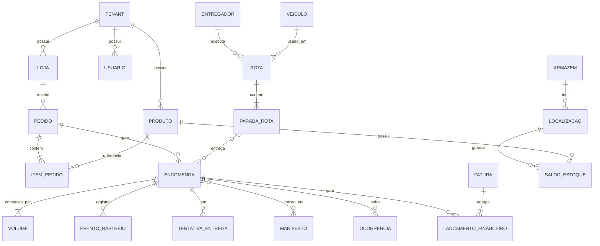
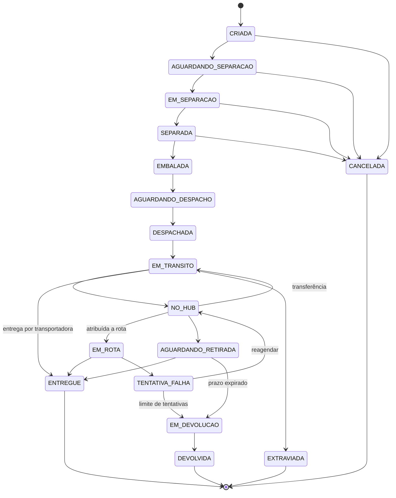

# LogiFlow — Documentação do Sistema

**Versão:** 1.0 · **Data:** 30/09/2026 · **Tipo de projeto:** estudo / uso pessoal (escopo de produto completo)

> Conjunto de documentos: `01-documentacao-do-sistema` (este) · `02-requisitos-funcionais` · `03-requisitos-nao-funcionais` · `04-regras-de-negocio` · `05-casos-de-uso`.
> "LogiFlow" é um nome provisório; troque à vontade.

---

## 1. Introdução

### 1.1 Propósito
O **LogiFlow** é uma plataforma de logística *multiempresa* (multi-tenant) para lojas de e-commerce. Cada empresa-cliente (lojista) integra sua loja ao LogiFlow e passa a contar com: cotação de frete, gestão de pedidos e encomendas, estoque e armazenagem, separação e despacho, transferência entre hubs, roteirização e entrega de última milha, rastreio público, ocorrências, logística reversa, financeiro do frete, notificações, webhooks e relatórios.

### 1.2 Objetivos
1. Servir como projeto de consolidação de estudos: arquitetura, modelagem de dados, APIs, front-end SPA, filas, tempo real, testes e DevOps.
2. Simular a operação de um operador logístico (3PL) de ponta a ponta, do pedido à entrega ou devolução.
3. Ser desenvolvido de forma **incremental** (fases do roadmap, seção 15), com cada fase entregando algo funcional.

### 1.3 Escopo
**Dentro do escopo:** tudo listado nos módulos da seção 4.

**Fora do escopo (simulado ou adiado):** emissão fiscal real (NF-e/CT-e/MDF-e), pagamento real (PIX/boleto/cartão), integração real com Correios/transportadoras (usa-se *adapters* com sandbox/mock), envio real de SMS/WhatsApp (adapter simulado), apps nativos (usa-se PWA), cálculo de rotas com trânsito em tempo real.

### 1.4 Público-alvo (atores)
| Ator | Descrição |
|---|---|
| Super Admin | Dono da plataforma; gerencia empresas, parâmetros globais e auditoria. |
| Gestor da Empresa | Administrador do lojista; configura loja, usuários, contratos, webhooks e vê financeiro. |
| Operador da Empresa | Usuário do lojista; acompanha pedidos, encomendas, estoque e ocorrências. |
| Operador de Armazém/Hub | Recebe, armazena, separa, embala e confere. |
| Despachante | Gera etiquetas e manifestos, entrega volumes às transportadoras/rotas. |
| Roteirizador | Planeja e atribui rotas de entrega. |
| Entregador | Executa rotas pelo app (PWA), registra entregas e tentativas. |
| Financeiro | Fecha faturas, concilia custos, gere repasses. |
| Suporte | Atende ocorrências e consultas. |
| Destinatário | Cliente final; rastreia, reagenda, confirma entrega. |
| Sistemas externos | Plataforma de e-commerce, transportadoras, serviços de CEP, geocodificação, e-mail/SMS. |

---

## 2. Visão geral do fluxo



A descrição detalhada do fluxo crítico (etapas, estados, regras, desvios e invariantes) está em `05-casos-de-uso`, seção 5.

---

## 3. Requisitos de alto nível (resumo)
Detalhes completos nos documentos 02 (RF), 03 (RNF), 04 (RN) e 05 (casos de uso). Rastreabilidade: cada caso de uso referencia RF e RN; cada RF referencia seu módulo (`RF-<MÓDULO>-NN`).

---

## 4. Módulos do sistema

| Sigla | Módulo | Responsabilidade |
|---|---|---|
| AUT | Autenticação e Acesso | Login, tokens, 2FA, papéis (RBAC), API keys. |
| TEN | Empresas e Lojas | Tenants, lojas, endereços de origem, configurações, contratos. |
| CAT | Produtos e Estoque | SKUs, armazéns, localizações, saldos, movimentações, inventário. |
| PED | Pedidos | Recepção/importação, validação, edição, cancelamento. |
| FRE | Frete | Zonas, tabelas, serviços, cotação, seguro, prazos. |
| ENC | Encomendas | Remessas, volumes, código de rastreio, máquina de estados. |
| DES | Despacho | Separação, embalagem, etiquetas, manifestos, coletas. |
| TRA | Transportadoras | Cadastro, adapters de integração, seleção automática. |
| HUB | Hubs e Transferências | Recebimento, consolidação, linehaul. |
| ROT | Rotas e Entregas | Veículos, entregadores, roteirização, PWA, POD. |
| RAS | Rastreio | Página pública, API, mapa, ETA. |
| OCO | Ocorrências e Devoluções | Tratamento de problemas, logística reversa, indenização. |
| FIN | Financeiro | Preço/custo, extrato, faturas, conciliação, repasses. |
| NOT | Notificações e Webhooks | E-mail/SMS/in-app, webhooks de saída. |
| REL | Relatórios e Dashboards | KPIs, exportações. |
| INT | Integrações e API Pública | API versionada, OpenAPI, conectores, CSV, sandbox. |
| AUD | Auditoria e Administração | Logs, parâmetros, jobs, LGPD, super admin. |

---

## 5. Arquitetura

### 5.1 Estilo arquitetural
**Monólito modular** no back-end (um deploy, módulos com fronteiras claras, comunicação interna por interfaces e eventos de domínio). Motivo: reduz a complexidade operacional de um projeto solo e permite extrair módulos para serviços no futuro (ex.: Rastreio, Notificações) caso queira estudar microsserviços.

Cada módulo segue **Clean Architecture / DDD leve**:
```
module/
  domain/          # entidades, value objects, eventos, regras puras
  application/     # casos de uso (services/handlers), DTOs, ports
  infrastructure/  # repositórios Prisma, adapters externos, filas
  presentation/    # controllers REST, guards, validação
```
Regra de dependência: `presentation → application → domain`; `infrastructure` implementa *ports* definidos em `application`.

### 5.2 Visão de componentes


### 5.3 Multi-tenancy
- **Estratégia:** banco único, esquema único, coluna `tenant_id` em todas as tabelas de negócio (*shared schema*).
- O `tenant_id` vem do token (usuário) ou da API key; é injetado em um contexto de requisição (AsyncLocalStorage) e aplicado automaticamente via **Prisma Client Extension** em todas as queries (filtro + preenchimento na criação).
- Defesa em profundidade (opcional/avançada): **Row-Level Security** do PostgreSQL com `SET LOCAL app.tenant_id`.
- Papéis internos (operador de hub, entregador, roteirizador) pertencem ao **tenant operador** (a própria plataforma), com acesso às encomendas de todos os lojistas dentro das permissões.

### 5.4 Comunicação assíncrona e eventos
- **Eventos de domínio** (ex.: `EncomendaDespachada`, `EntregaConcluida`) publicados após commit (padrão *outbox*: tabela `outbox_event` lida por worker, garantindo entrega *at-least-once*).
- **Filas (BullMQ/Redis):** notificações, webhooks, geração de etiquetas em lote, faturamento, importação CSV, polling de transportadoras, roteirização.
- **Tempo real (WebSocket/Socket.IO):** posição do entregador, painel operacional ao vivo, notificações in-app.
- **Jobs agendados (cron):** fechamento de faturas, detecção de extravio, expiração de reservas, retenção de dados (LGPD).

### 5.5 Decisões arquiteturais (ADRs resumidos)
| # | Decisão | Alternativa descartada | Motivo |
|---|---|---|---|
| ADR-01 | Monólito modular | Microsserviços | Menos custo operacional; fronteiras já preparadas. |
| ADR-02 | `tenant_id` compartilhado | Schema/banco por tenant | Simplicidade e migrations únicas. |
| ADR-03 | Outbox + BullMQ | Publicar direto em fila | Consistência entre banco e eventos. |
| ADR-04 | Eventos de rastreio imutáveis (*append-only*) | Atualizar status in-place | Auditoria e reconstrução do histórico. |
| ADR-05 | Dinheiro em centavos (inteiro) | `float` / `decimal` solto | Evita erro de arredondamento. |
| ADR-06 | Datas em UTC, exibição `America/Sao_Paulo` | Datas locais | Evita bugs de fuso e horário de verão. |
| ADR-07 | PWA para entregador | App nativo | Mesmo stack, câmera/GPS via Web APIs. |
| ADR-08 | Adapters para transportadoras | Integração direta | Troca/mocking sem tocar no domínio. |

---

## 6. Stack tecnológica

### 6.1 Obrigatórias (definidas por você)
| Tecnologia | Uso |
|---|---|
| HTML5 / CSS3 / JavaScript | Base da web; templates Angular, estilos globais e APIs do navegador. |
| TypeScript | Linguagem principal de front **e** back (tipos compartilhados). |
| Angular (v19+, standalone + Signals) | SPAs: painéis e PWA. |
| TailwindCSS | Estilização utilitária e design system próprio. |
| PostgreSQL | Banco relacional principal. |
| Prisma ORM | Acesso a dados, migrations e tipagem. |

### 6.2 Recomendadas (adicionais)
| Tecnologia | Uso e justificativa |
|---|---|
| **Node.js 22 LTS + NestJS** | Back-end modular, DI nativa, guards/interceptors, ótimo para monólito modular em TypeScript. |
| **Redis** | Cache, rate limit, locks, backend das filas. |
| **BullMQ** | Filas, retries, agendamento. |
| **Socket.IO** | Tempo real (posição, painel ao vivo). |
| **Zod** (ou class-validator) | Validação de entrada e contratos. |
| **OpenAPI/Swagger** (`@nestjs/swagger`) | Documentação e geração de clientes. |
| **Nx** (ou pnpm workspaces) | Monorepo: apps + libs compartilhadas (tipos, contratos). |
| **PostGIS** *(opcional)* | Consultas geoespaciais; Prisma o trata como `Unsupported`, então usar `$queryRaw` onde necessário. |
| **Leaflet + OpenStreetMap** | Mapas sem custo. |
| **OSRM** (Docker) | Distância/tempo de rotas e matriz de distâncias. |
| **MinIO (S3)** | Fotos de POD, anexos, PDFs. |
| **bwip-js / PDFKit** | Códigos de barras/QR e etiquetas PDF/ZPL. |
| **Angular CDK, Angular Material (opcional)** | Drag-and-drop de paradas, overlays, a11y. |
| **Chart.js / ngx-charts** | Gráficos dos dashboards. |
| **Docker + Docker Compose** | Ambiente reproduzível (Postgres, Redis, MinIO, MailHog, OSRM). |
| **Jest/Vitest, Supertest, Playwright, Testcontainers** | Testes unitários, integração e E2E. |
| **Pino + OpenTelemetry + Prometheus/Grafana** | Logs estruturados, métricas e tracing. |
| **ESLint, Prettier, Husky, Commitlint** | Qualidade e padrão de commits. |
| **GitHub Actions** | CI/CD. |
| **MailHog / Mailpit** | Capturar e-mails em desenvolvimento. |

---

## 7. Modelo de domínio e de dados

### 7.1 Entidades principais
| Entidade | Principais atributos | Relações |
|---|---|---|
| `Tenant` | id, tipo (OPERADOR/LOJISTA), razaoSocial, cnpj, status, configuracoes(json) | 1:N Loja, Usuario, Contrato |
| `Loja` | id, tenantId, nome, dominio, enderecoOrigemId, webhookSecret | N:1 Tenant |
| `Usuario` | id, tenantId, nome, email, senhaHash, papel, totpSecret?, status | N:1 Tenant |
| `ApiKey` | id, tenantId, hash, escopos, ultimoUso, revogadaEm | N:1 Tenant |
| `Produto` | id, tenantId, sku, nome, pesoG, alturaCm, larguraCm, comprimentoCm, valorCentavos, fragil | 1:N Saldo |
| `Armazem` / `Hub` | id, nome, tipo, endereco, lat, lng, capacidade | 1:N Localizacao |
| `Localizacao` | id, armazemId, codigo (corredor-prateleira-nível) | N:1 Armazem |
| `SaldoEstoque` | produtoId, localizacaoId, quantidade, reservada | — |
| `MovimentoEstoque` | id, produtoId, tipo, quantidade, origem, motivo, usuarioId | imutável |
| `Pedido` | id, tenantId, lojaId, numeroExterno, status, destinatarioId, enderecoEntregaId, valorProdutosCentavos, valorDeclarado | 1:N ItemPedido, Encomenda |
| `ItemPedido` | pedidoId, produtoId, quantidade, valorUnitarioCentavos | — |
| `Destinatario` | id, nome, documento, email, telefone | 1:N Endereco |
| `Endereco` | id, cep, logradouro, numero, complemento, bairro, cidade, uf, lat, lng, validado | — |
| `Encomenda` | id, tenantId, pedidoId, codigoRastreio, servicoId, status, pesoTaxavelG, freteCentavos, seguroCentavos, prazoPrevisto, prioridade | 1:N Volume, EventoRastreio |
| `Volume` | id, encomendaId, numero, pesoG, dimensoes, codigoBarras | — |
| `EventoRastreio` | id, encomendaId, tipo, descricao, localizacao, origem, ocorridoEm, payload | append-only |
| `ZonaFrete` / `TabelaFrete` / `FaixaPreco` | faixas de CEP, faixas de peso, preço, prazo, versão | N:1 Contrato/Servico |
| `ServicoEntrega` | id, codigo (ECONOMICO/EXPRESSO/SAME_DAY), prazoBase, modal | — |
| `Transportadora` | id, nome, adapter, config, ativa | 1:N ServicoEntrega |
| `Manifesto` | id, tipo, status, hubOrigem, hubDestino, transportadoraId | N:M Encomenda |
| `Veiculo` | id, placa, tipo, capacidadePesoG, capacidadeVolumeCm3 | — |
| `Entregador` | id, usuarioId, cnh, categoria, veiculoPadraoId | — |
| `Rota` | id, data, entregadorId, veiculoId, hubId, status, distanciaM, inicioEm, fimEm | 1:N ParadaRota |
| `ParadaRota` | rotaId, ordem, enderecoId, janelaInicio, janelaFim, status | N:M Encomenda |
| `TentativaEntrega` | id, encomendaId, rotaId, resultado, motivo, pod(json), lat, lng, em | — |
| `Ocorrencia` | id, encomendaId, tipo, status, prazoSla, responsavelId | 1:N AnexoOcorrencia |
| `Devolucao` | id, encomendaOrigemId, encomendaReversaId, motivo, status, inspecao | — |
| `Indenizacao` | id, ocorrenciaId, valorCentavos, status | — |
| `Fatura` / `ItemFatura` | id, tenantId, periodo, vencimento, totalCentavos, status | 1:N ItemFatura |
| `LancamentoFinanceiro` | id, tenantId, encomendaId, tipo, valorCentavos, referencia | — |
| `RepasseEntregador` | id, entregadorId, periodo, totalCentavos, status | — |
| `WebhookEndpoint` / `WebhookEntrega` | url, segredo, eventos / tentativas, statusHttp | — |
| `Notificacao` / `TemplateNotificacao` | canal, destinatario, status / corpo, variáveis | — |
| `AuditLog` | id, tenantId, usuarioId, acao, entidade, antes, depois, ip, em | append-only |
| `OutboxEvent` | id, tipo, payload, processadoEm | — |

### 7.2 Diagrama ER (núcleo)


### 7.3 Convenções de banco
- Chaves primárias **UUID v7** (ordenáveis) ou `cuid2`; nomes de tabela em `snake_case` via `@@map`.
- Colunas obrigatórias: `created_at`, `updated_at`; *soft delete* (`deleted_at`) apenas onde há exigência de histórico.
- Dinheiro: inteiro em centavos. Peso: gramas. Dimensões: centímetros (inteiro ou decimal 1 casa).
- Índices: `(tenant_id, …)` em toda consulta frequente; `codigo_rastreio` único global; `(encomenda_id, ocorrido_em)` em eventos.
- Restrições `CHECK` (quantidade ≥ 0, peso > 0) além das validações da aplicação.
- Migrations versionadas via `prisma migrate`; *seeds* determinísticos para desenvolvimento.

---

## 8. Ciclo de vida da encomenda


Transições são feitas **somente** por um serviço de domínio (`EncomendaStateMachine`) que valida a origem, grava um `EventoRastreio` e publica o evento de domínio correspondente. As regras de cada transição estão no documento 04.

---

## 9. Design da API

### 9.1 Convenções
- REST sobre HTTPS, JSON, prefixo `/api/v1`. Recursos no plural e em português consistente (`/pedidos`, `/encomendas`).
- Paginação por cursor (`?cursor=&limit=`), filtros por query string, ordenação `?sort=-criadoEm`.
- Erros no formato **RFC 9457 (Problem Details)**: `type`, `title`, `status`, `detail`, `errors[]`, `traceId`.
- `Idempotency-Key` em `POST` críticos (pedidos, encomendas).
- Autenticação: **JWT** (usuários dos painéis) e **API Key** (`Authorization: Bearer lf_live_…`) para integrações.
- Rate limit por chave e por IP; cabeçalhos `X-RateLimit-*`.
- Versionamento no caminho; mudanças incompatíveis → `v2`.

### 9.2 Endpoints principais (amostra)
| Método | Rota | Descrição |
|---|---|---|
| POST | `/auth/login` · `/auth/refresh` · `/auth/logout` | Sessão. |
| POST | `/fretes/cotacoes` | Cotação para um CEP, volumes e valor. |
| POST | `/pedidos` | Cria pedido (idempotente). |
| GET | `/pedidos?status=&de=&ate=` | Lista com filtros. |
| POST | `/pedidos/{id}/encomendas` | Gera encomenda(s). |
| POST | `/encomendas/{id}/cancelar` | Cancela, se permitido. |
| GET | `/encomendas/{id}/eventos` | Histórico. |
| POST | `/despacho/ondas` · `/despacho/separacao/{id}/confirmar` | Separação. |
| POST | `/despacho/etiquetas` | Gera etiquetas (lote). |
| POST | `/manifestos` · `/manifestos/{id}/fechar` | Manifesto. |
| POST | `/hubs/{id}/recebimentos` | Entrada de volumes (scan). |
| POST | `/rotas` · `/rotas/otimizar` · `/rotas/{id}/atribuir` | Planejamento. |
| POST | `/rotas/{id}/paradas/{pid}/entrega` | Registra entrega com POD. |
| POST | `/rotas/{id}/paradas/{pid}/falha` | Tentativa falha. |
| GET | `/public/rastreio/{codigo}` | Rastreio público (sem auth, rate limited). |
| POST | `/ocorrencias` · `/devolucoes` | Problemas e reversa. |
| GET | `/financeiro/extrato` · `/faturas` | Financeiro. |
| CRUD | `/webhooks` | Endpoints do lojista. |

### 9.3 Webhooks de saída
- Eventos: `pedido.criado`, `encomenda.criada`, `encomenda.despachada`, `encomenda.em_rota`, `encomenda.entregue`, `encomenda.tentativa_falha`, `encomenda.devolvida`, `ocorrencia.aberta`, `fatura.fechada`.
- Corpo JSON com `id` do evento, `tipo`, `criadoEm`, `dados`. Assinatura: cabeçalho `X-LogiFlow-Signature: sha256=<HMAC(segredo, corpo)>` + `X-LogiFlow-Timestamp`.
- Reentrega com *backoff* exponencial; painel de logs com reenvio manual.

---

## 10. Front-end

### 10.1 Aplicações
| App | Público | Observações |
|---|---|---|
| `painel-lojista` | Gestor/Operador da empresa | Pedidos, encomendas, estoque, financeiro, integrações. |
| `painel-operacional` | Hub, despacho, roteirização, suporte, financeiro | Telas de bipagem, filas, mapa, ocorrências. |
| `app-entregador` | Entregador | **PWA** *mobile-first*, offline parcial (fila de sincronização), câmera e geolocalização. |
| `rastreio-publico` | Destinatário | Leve, SEO, acessível, branding por loja. |

### 10.2 Padrões
- Angular **standalone components**, **Signals** para estado local, `@ngrx/signals` (SignalStore) para estado de feature; RxJS onde há streams (WebSocket, busca com *debounce*).
- *Lazy loading* por feature/rota; *guards* por papel; interceptors (auth, tenant, erros, loading).
- Formulários reativos tipados; validações compartilhadas via lib comum de schemas.
- **Design system** em Tailwind: tokens (cores, espaçamento, tipografia) no `tailwind.config`, componentes base (botão, input, tabela, modal, toast, badge de status) em lib `ui`.
- Acessibilidade WCAG 2.1 AA, tema claro/escuro, i18n (pt-BR padrão; en-US preparado).
- Service Worker (Angular PWA) para o app do entregador e cache do rastreio.

---

## 11. Estrutura do repositório (monorepo Nx)

```
logiflow/
├─ apps/
│  ├─ api/                    # NestJS (monólito modular)
│  ├─ worker/                 # processos de fila/cron (pode reutilizar libs da api)
│  ├─ painel-lojista/         # Angular
│  ├─ painel-operacional/     # Angular
│  ├─ app-entregador/         # Angular PWA
│  └─ rastreio-publico/       # Angular
├─ libs/
│  ├─ contracts/              # DTOs, schemas Zod, enums, tipos compartilhados
│  ├─ ui/                     # design system Tailwind + componentes Angular
│  ├─ util/                   # helpers (datas, dinheiro, CEP, CPF/CNPJ)
│  └─ api-client/             # cliente tipado gerado do OpenAPI
├─ prisma/
│  ├─ schema.prisma
│  ├─ migrations/
│  └─ seed.ts
├─ docker/                    # compose, configs (OSRM, Prometheus, Grafana)
├─ docs/                      # estes documentos + ADRs
└─ .github/workflows/
```

---

## 12. Segurança (visão geral)
- Senhas com **Argon2id**; JWT de acesso curto (15 min) + *refresh token* rotativo (7 dias) armazenado com hash.
- RBAC por permissões granulares (`encomenda:ler`, `rota:atribuir`…) mapeadas a papéis.
- Isolamento de tenant (seção 5.3) coberto por testes automatizados.
- Validação de entrada em toda borda; *output encoding*; proteção contra OWASP Top 10 (injeção, SSRF em webhooks, IDOR, mass assignment).
- Webhooks de saída: bloquear destinos em redes privadas (anti-SSRF), HTTPS obrigatório.
- Segredos em variáveis de ambiente / secret manager; nunca no repositório.
- Cabeçalhos de segurança (Helmet), CORS restrito, CSRF não se aplica a JWT em header (se usar cookie, habilitar proteção).
- LGPD: minimização, finalidade, retenção e anonimização (RNF e RN específicos).

## 13. Observabilidade e DevOps
- Logs JSON (Pino) com `traceId`, `tenantId`, `userId`; métricas (latência, filas, erros) em Prometheus; painéis no Grafana; *health checks* `/health/live` e `/health/ready`.
- Ambientes: `local` (Docker Compose), `staging`, `produção` (opcional, para estudo: VPS ou PaaS).
- CI: lint → testes unitários → build → testes de integração (Testcontainers) → E2E (Playwright) → imagem Docker.
- Migrações automáticas em *deploy* com revisão; *rollback* planejado.

## 14. Estratégia de testes
| Nível | Ferramentas | Foco |
|---|---|---|
| Unitário | Jest/Vitest | Domínio puro: cálculo de frete, máquina de estados, regras de estoque. |
| Integração | Supertest + Testcontainers (Postgres/Redis) | Repositórios, módulos, isolamento de tenant. |
| Contrato | OpenAPI + Schemathesis/Dredd (opcional) | Conformidade da API pública. |
| E2E | Playwright | Jornadas: pedido → entrega; devolução; rastreio. |
| Carga | k6 | Cotação, rastreio público, ingestão de pedidos. |
Meta: ≥ 80% de cobertura no domínio/aplicação; 100% das regras RN críticas com teste nomeado pelo ID (ex.: `RN-FRE-03`).

---

## 15. Roadmap sugerido (fases)

| Fase | Entrega | Módulos | Aprendizado-chave |
|---|---|---|---|
| 0 | Fundação | Monorepo, Docker, CI, Prisma, auth básica | Setup, arquitetura, JWT, RBAC |
| 1 | Cadastros | TEN, AUT completo, CAT (produtos), endereços | CRUD, multi-tenant, validações |
| 2 | Pedido → Encomenda | PED, FRE (cotação), ENC, RAS básico | Domínio rico, máquina de estados |
| 3 | Armazém e despacho | CAT (estoque), DES, etiquetas, manifestos | Concorrência, filas, PDFs |
| 4 | Transporte | TRA (adapters mock), HUB, eventos externos | Padrão adapter, integrações |
| 5 | Última milha | ROT, PWA do entregador, POD, mapa, WebSocket | Tempo real, PWA, geolocalização |
| 6 | Exceções | OCO, devoluções, reentrega, indenização | Fluxos complexos |
| 7 | Dinheiro | FIN, faturas, repasses, conciliação | Precisão, jobs agendados |
| 8 | Ecossistema | NOT, webhooks, INT, REL, AUD | Eventos, outbox, relatórios |
| 9 | Endurecimento | Observabilidade, carga, segurança, LGPD | Produção |

Prioridades de requisitos: **M** (Must, essencial), **S** (Should, importante), **C** (Could, desejável). O MVP é composto por todos os **M** das fases 0–5.

---

## 16. Glossário
| Termo | Significado |
|---|---|
| Última milha | Trecho final do hub até o destinatário. |
| Hub / CD | Centro de distribuição onde volumes são recebidos, consolidados e despachados. |
| Linehaul | Transporte de longa distância entre hubs. |
| Cross-docking | Transferência sem armazenagem prolongada. |
| Picking / Packing | Separação / embalagem de itens. |
| Onda (wave) | Lote de pedidos separados juntos. |
| Romaneio / Manifesto | Lista de volumes entregues a uma transportadora/rota. |
| POD | *Proof of Delivery*, comprovante de entrega. |
| SLA | Prazo/nível de serviço acordado. |
| Peso cubado | Peso equivalente pelo volume (C×L×A / 6000). |
| Logística reversa | Fluxo de devolução do destinatário ao remetente. |
| Redespacho | Repasse a outra transportadora para o trecho final. |
| ETA | Estimativa de chegada. |
| Tenant | Empresa-cliente isolada logicamente na plataforma. |

## 17. Riscos e mitigação
| Risco | Mitigação |
|---|---|
| Escopo gigante para um desenvolvedor solo | Fases pequenas; MVP claro; backlog priorizado por MoSCoW. |
| Vazamento entre tenants | Extension do Prisma + RLS + testes automáticos de isolamento. |
| Concorrência no estoque | Transações, `SELECT … FOR UPDATE`/atualização atômica condicional, testes de corrida. |
| Roteirização complexa | Começar com heurística simples (agrupar por CEP + vizinho mais próximo); evoluir para OSRM/VRP. |
| Limites do Prisma (PostGIS, queries complexas) | `$queryRaw` isolado em repositórios, com testes. |
| Dependência de APIs externas | Adapters, cache, *circuit breaker*, mocks. |

## 18. Convenções de desenvolvimento
- **Git:** *trunk-based* com branches curtas `feat/…`, `fix/…`; **Conventional Commits**; PRs com checklist (testes, docs, RN referenciada).
- **Nomes:** código em inglês *ou* português — escolha **um** e mantenha; este projeto usa português no domínio (`Encomenda`, `Despacho`) e inglês na infraestrutura técnica.
- **Definition of Done:** testes passando, lint ok, migração revisada, OpenAPI atualizado, documentação de RN/RF atualizada se houver mudança.
