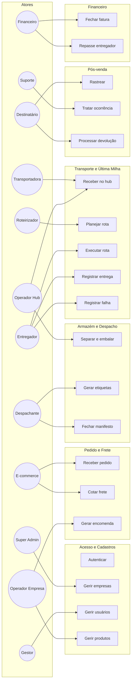
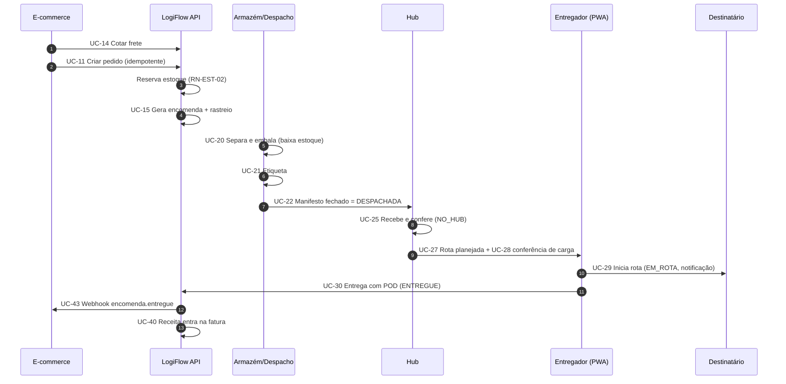

# LogiFlow — Casos de Uso

**Versão:** 1.0 · **Data:** 30/09/2026
Este documento descreve os atores, o catálogo completo de casos de uso (UC) e a especificação detalhada dos casos mais importantes. Cada caso referencia os requisitos (`RF-…`) e regras (`RN-…`) relacionados.

---

## 1. Atores

| Código | Ator | Tipo | Descrição |
|---|---|---|---|
| A01 | Super Admin | Humano | Administra a plataforma, empresas, contratos e auditoria. |
| A02 | Gestor da Empresa | Humano | Administra a empresa lojista, usuários, configurações e webhooks. |
| A03 | Operador da Empresa | Humano | Acompanha pedidos, encomendas, estoque e ocorrências do lojista. |
| A04 | Operador de Armazém/Hub | Humano | Recebe, armazena, separa, embala e confere. |
| A05 | Despachante | Humano | Etiquetas, manifestos, coletas e expedição. |
| A06 | Roteirizador | Humano | Planeja, atribui e acompanha rotas. |
| A07 | Entregador | Humano | Executa rotas e registra entregas pelo app. |
| A08 | Financeiro | Humano | Faturas, conciliação, repasses, indenizações. |
| A09 | Suporte | Humano | Atende e trata ocorrências. |
| A10 | Destinatário | Humano | Cliente final que recebe (ou devolve) o pedido. |
| A11 | Plataforma de E-commerce | Sistema externo | Envia pedidos e recebe eventos por API/webhook. |
| A12 | Transportadora | Sistema externo | Executa trechos de transporte e envia eventos. |
| A13 | Serviços de Apoio | Sistema externo | CEP, geocodificação, roteamento, e-mail/SMS. |
| A14 | Agendador (Scheduler) | Sistema interno | Dispara jobs periódicos (faturamento, expiração, extravio, retenção). |

---

## 2. Diagrama geral de casos de uso (por pacote)

---

## 3. Catálogo de casos de uso

**Legenda de prioridade:** M essencial · S importante · C desejável. Os casos marcados com ★ possuem especificação detalhada na seção 4.

### 3.1 Acesso e Cadastros
| ID | Caso de uso | Ator principal | RF | Prio |
|---|---|---|---|---|
| UC-01 ★ | Autenticar-se no sistema | Todos os humanos | RF-AUT-01..04 | M |
| UC-02 | Recuperar senha | Todos os humanos | RF-AUT-03 | M |
| UC-03 ★ | Cadastrar e configurar empresa | Super Admin | RF-TEN-01..05 | M |
| UC-04 | Suspender/reativar empresa | Super Admin | RF-TEN-01 | M |
| UC-05 | Configurar lojas, origens e parâmetros | Gestor | RF-TEN-02..04 | M |
| UC-06 | Gerir usuários e papéis | Gestor | RF-AUT-05..08 | M |
| UC-07 | Gerir chaves de API | Gestor | RF-AUT-09 | M |
| UC-08 | Cadastrar produtos (individual e CSV) | Operador Empresa | RF-CAT-01..03 | M |
| UC-09 | Cadastrar armazéns, hubs e localizações | Super Admin / Operador Hub | RF-CAT-04..05, RF-HUB-01 | M |
| UC-10 | Gerir tabelas de frete e serviços | Super Admin | RF-FRE-01..03, 09, 11 | M |

### 3.2 Pedido, Frete e Encomenda
| ID | Caso de uso | Ator principal | RF | Prio |
|---|---|---|---|---|
| UC-11 ★ | Receber pedido via API | E-commerce | RF-PED-01..05, 11 | M |
| UC-12 | Importar pedidos por CSV | Operador Empresa | RF-PED-03, 12 | S |
| UC-13 | Consultar e filtrar pedidos | Operador Empresa | RF-PED-06..07 | M |
| UC-14 ★ | Cotar frete | E-commerce / Operador | RF-FRE-04..08, 10, 13 | M |
| UC-15 ★ | Gerar encomenda a partir do pedido | Operador / Sistema | RF-ENC-01..05, RF-PED-10 | M |
| UC-16 | Editar endereço do pedido | Operador Empresa | RF-PED-08 | M |
| UC-17 | Cancelar pedido/encomenda | Operador Empresa | RF-PED-09, RF-ENC-08 | M |
| UC-18 | Reagendar entrega | Destinatário / Operador | RF-ENC-10, RF-RAS-07 | S |

### 3.3 Estoque, Armazém e Despacho
| ID | Caso de uso | Ator principal | RF | Prio |
|---|---|---|---|---|
| UC-19 ★ | Receber mercadoria e endereçar estoque | Operador de Armazém | RF-CAT-06..09 | M |
| UC-20 ★ | Separar e embalar encomenda | Operador de Armazém | RF-DES-01..07 | M |
| UC-21 ★ | Gerar e imprimir etiquetas | Despachante | RF-DES-08..09 | M |
| UC-22 ★ | Criar, conferir e fechar manifesto (despacho) | Despachante | RF-DES-10..12 | M |
| UC-23 | Agendar e registrar coleta no lojista | Despachante | RF-DES-13 | S |
| UC-24 | Realizar inventário e ajustar estoque | Operador de Armazém | RF-CAT-10..11 | S |

### 3.4 Transporte, Hub e Última Milha
| ID | Caso de uso | Ator principal | RF | Prio |
|---|---|---|---|---|
| UC-25 ★ | Receber volumes no hub | Operador de Hub | RF-HUB-02, 05 | M |
| UC-26 | Transferir volumes entre hubs (linehaul) | Despachante / Operador Hub | RF-HUB-03..04 | M |
| UC-27 ★ | Planejar e atribuir rota | Roteirizador | RF-ROT-03..06, 15 | M |
| UC-28 | Conferir carga do veículo | Operador de Hub | RF-ROT-07 | M |
| UC-29 ★ | Executar rota (iniciar, navegar, encerrar) | Entregador | RF-ROT-08..09, 12..13, 16 | M |
| UC-30 ★ | Registrar entrega com comprovante (POD) | Entregador | RF-ROT-10 | M |
| UC-31 ★ | Registrar tentativa de entrega frustrada | Entregador | RF-ROT-11 | M |
| UC-32 | Integrar eventos de transportadora | Transportadora / Sistema | RF-TRA-02..06 | M |
| UC-33 ★ | Rastrear encomenda | Destinatário | RF-RAS-01..03, 08 | M |
| UC-34 | Monitorar rotas ao vivo | Roteirizador | RF-ROT-17..18 | S |

### 3.5 Ocorrências e Devoluções
| ID | Caso de uso | Ator principal | RF | Prio |
|---|---|---|---|---|
| UC-35 ★ | Tratar ocorrência | Suporte | RF-OCO-01..04, 10..11 | M |
| UC-36 | Solicitar devolução | Destinatário / Operador | RF-OCO-05 | M |
| UC-37 ★ | Processar devolução (reversa e inspeção) | Operador de Hub | RF-OCO-06..08 | M |
| UC-38 | Solicitar e aprovar indenização | Suporte / Financeiro | RF-OCO-09 | S |

### 3.6 Financeiro, Notificações e Administração
| ID | Caso de uso | Ator principal | RF | Prio |
|---|---|---|---|---|
| UC-39 | Consultar extrato financeiro | Gestor / Financeiro | RF-FIN-01..02 | M |
| UC-40 ★ | Fechar fatura periódica | Agendador / Financeiro | RF-FIN-03..06 | M |
| UC-41 | Conciliar custos de transportadora | Financeiro | RF-FIN-08 | S |
| UC-42 | Fechar repasse de entregadores | Financeiro | RF-FIN-09 | S |
| UC-43 ★ | Notificar eventos (e-mail e webhook) | Sistema | RF-NOT-01..07 | M |
| UC-44 | Configurar webhooks e consultar entregas | Gestor | RF-TEN-06, RF-NOT-07 | M |
| UC-45 | Consultar dashboards e relatórios | Gestor / Operadores | RF-REL-01..07 | M |
| UC-46 | Exportar relatórios | Todos com acesso | RF-REL-06 | S |
| UC-47 | Consultar auditoria | Super Admin | RF-AUD-01..02 | M |
| UC-48 | Atender solicitação LGPD | Super Admin | RF-AUD-05..06 | S |
| UC-49 | Monitorar filas e jobs | Super Admin | RF-AUD-04 | S |
| UC-50 | Detectar atrasos e extravios (job) | Agendador | RF-ENC-11, RF-OCO-02 | M |

---

## 4. Especificações detalhadas

> **Convenções:** FP = Fluxo principal; FA = Fluxo alternativo; FE = Fluxo de exceção. Pré-condições (Pré) e pós-condições (Pós) usam termos do documento 04.

---

### UC-01 — Autenticar-se no sistema
- **Ator:** qualquer usuário humano · **RF:** RF-AUT-01, 02, 04, 08 · **RN:** RN-SEG-02, 04, 06
- **Pré:** usuário ativo, empresa não suspensa para papéis de empresa.
- **FP:**
  1. Usuário informa e-mail e senha.
  2. Sistema valida credenciais e estado da conta.
  3. Se o papel exige 2FA, sistema solicita o código TOTP; usuário informa.
  4. Sistema emite *access token* e *refresh token* e registra a sessão.
  5. Sistema redireciona para a tela inicial conforme o papel.
- **FA1 — 2FA não configurado (papel obrigatório):** sistema conduz ao cadastro do TOTP antes de concluir.
- **FA2 — Renovação:** com *access token* expirado, o cliente usa o *refresh token* e recebe novo par.
- **FE1 — Credenciais inválidas:** mensagem genérica; incrementa contador (RN-SEG-02).
- **FE2 — Conta bloqueada:** informa tempo restante.
- **FE3 — Reuso de *refresh token*:** sistema revoga a família de tokens e exige novo login.
- **Pós:** sessão ativa registrada; auditoria de login.

---

### UC-03 — Cadastrar e configurar empresa
- **Ator:** Super Admin · **RF:** RF-TEN-01..05 · **RN:** RN-GER-03, 04
- **Pré:** Super Admin autenticado com 2FA.
- **FP:**
  1. Super Admin informa CNPJ, razão social, contatos e plano de faturamento (ciclo).
  2. Sistema valida CNPJ (dígitos e unicidade).
  3. Sistema cria o tenant e o primeiro usuário `GESTOR` (convite por e-mail).
  4. Super Admin vincula contrato: serviços, tabelas de frete, vigência.
  5. Sistema ativa a empresa e registra auditoria.
- **FA1 — Copiar contrato de outra empresa:** sistema duplica tabelas e permite ajustes.
- **FE1 — CNPJ duplicado/ inválido:** bloqueia e exibe a empresa existente (se permitido).
- **Pós:** empresa ativa; gestor convidado; chaves de API ainda não geradas.

---

### UC-11 — Receber pedido via API
- **Ator:** Plataforma de E-commerce · **Apoio:** Serviços de CEP/geocodificação · **RF:** RF-PED-01, 02, 04, 05, 11 · **RN:** RN-PED-01..04, RN-CAD-04, RN-GER-04
- **Pré:** chave de API válida com escopo `pedidos:escrever`; empresa ativa.
- **FP:**
  1. E-commerce envia `POST /pedidos` com itens, destinatário, endereço e `Idempotency-Key`.
  2. Sistema valida autenticação, escopo e esquema do payload.
  3. Sistema verifica idempotência (loja + número externo).
  4. Sistema valida/normaliza o endereço (CEP) e geocodifica.
  5. Sistema valida produtos (SKU existente e completo).
  6. Sistema persiste o pedido como `CONFIRMADO`, reserva estoque (RN-EST-02) e publica `pedido.criado`.
  7. Sistema responde `201` com o pedido e o link de acompanhamento.
- **FA1 — Pedido já existente:** responde `200` com o pedido original (sem duplicar).
- **FA2 — Endereço com inconsistência corrigível:** pedido fica `PENDENTE_VALIDACAO` e entra na fila de pendências (RN-PED-03/04); resposta `202`.
- **FA3 — Sem estoque:** pedido `CONFIRMADO` com itens em *backorder* (RN-EST-02).
- **FE1 — Payload inválido:** `422` em Problem Details com lista de erros.
- **FE2 — Serviço de CEP indisponível:** usa cache; se não houver, aceita como `PENDENTE_VALIDACAO` (degradação graciosa).
- **FE3 — SKU inexistente:** `422` identificando os itens.
- **Pós:** pedido registrado; reservas efetuadas; webhook enviado à loja (UC-43).

---

### UC-14 — Cotar frete
- **Ator:** E-commerce ou Operador da Empresa · **RF:** RF-FRE-04..08, 10, 13 · **RN:** RN-FRE-01..14
- **Pré:** contrato vigente; produtos com peso/dimensões.
- **FP:**
  1. Ator informa CEP de destino, volumes (ou SKUs/quantidades) e valor declarado.
  2. Sistema calcula peso cubado e taxável por volume (RN-FRE-01/02).
  3. Sistema identifica a zona do CEP (RN-FRE-05) e filtra serviços elegíveis (limites, restrições, corte).
  4. Para cada serviço, calcula preço-base, taxas, seguro e promoções (RN-FRE-03, 08..12).
  5. Calcula prazo considerando corte e feriados (RN-FRE-06).
  6. Sistema retorna a lista ordenada (preço/prazo), gerando `cotacaoId` válido por 24 h.
- **FA1 — Cotação por SKUs:** sistema agrupa itens em volumes padrão da loja.
- **FA2 — Frete grátis aplicável:** preço-base zerado, com indicação da regra.
- **FE1 — CEP sem cobertura:** retorna lista vazia com motivo.
- **FE2 — Volume acima dos limites:** serviços incompatíveis são omitidos; se nenhum atender, retorna erro explicativo.
- **Pós:** cotação registrada (para auditoria e para ser usada na criação da encomenda).

---

### UC-15 — Gerar encomenda a partir do pedido
- **Ator:** Operador da Empresa (manual) ou Sistema (automático por regra) · **RF:** RF-ENC-01..05, RF-PED-10, RF-FRE-13 · **RN:** RN-ENC-01..05, RN-PED-07, RN-FRE-14
- **Pré:** pedido `CONFIRMADO`, endereço válido, sem pendências.
- **FP:**
  1. Sistema/ator seleciona o pedido e o serviço (ou aplica regra automática de seleção).
  2. Sistema recupera ou recalcula a cotação (RN-FRE-14).
  3. Sistema define volumes (por produto/embalagem padrão) e valida limites.
  4. Sistema gera código de rastreio e códigos de volumes (RN-ENC-01/02).
  5. Sistema cria a encomenda `CRIADA`, grava evento `PEDIDO_RECEBIDO` e a coloca em `AGUARDANDO_SEPARACAO`.
  6. Sistema lança a previsão financeira (RN-FIN-01) e publica `encomenda.criada`.
- **FA1 — Divisão em várias encomendas:** itens em armazéns distintos ou excedendo limites geram N encomendas (RN-PED-07).
- **FA2 — Seleção automática de transportadora/modal:** aplica RN-TRA-01.
- **FE1 — Produto incompleto/proibido:** bloqueia e indica o item (RN-CAD-02, RN-FRE-13).
- **FE2 — Empresa inadimplente/suspensa:** bloqueia (RN-GER-03, RN-FIN-07).
- **Pós:** encomenda criada com rastreio; fila de separação atualizada.

---

### UC-19 — Receber mercadoria e endereçar estoque
- **Ator:** Operador de Armazém · **RF:** RF-CAT-06..09 · **RN:** RN-EST-01, 06, 07
- **Pré:** produtos cadastrados; aviso de recebimento (ASN) opcional.
- **FP:**
  1. Operador abre o recebimento (opcionalmente vinculado à ASN) e identifica a empresa.
  2. Lê/seleciona cada SKU e informa a quantidade conferida (lote/validade, se aplicável).
  3. Sistema compara com o esperado.
  4. Operador confirma o recebimento; sistema gera tarefas de endereçamento.
  5. Operador lê a localização e confirma a guarda (*put-away*).
  6. Sistema registra movimentos de entrada e atualiza saldos.
- **FA1 — Divergência de quantidade:** registra divergência com fotos; aguarda decisão (RN-EST-07).
- **FA2 — Recebimento sem ASN:** cria recebimento avulso, sujeito à aprovação do Gestor.
- **FE1 — SKU desconhecido:** coloca em "quarentena" e notifica o Operador da Empresa.
- **Pós:** saldo disponível atualizado; movimentos imutáveis registrados.

---

### UC-20 — Separar e embalar encomenda
- **Ator:** Operador de Armazém · **RF:** RF-DES-01..07, RF-CAT-09 · **RN:** RN-DES-01..04, RN-EST-04, 05
- **Pré:** encomenda em `AGUARDANDO_SEPARACAO`; estoque reservado.
- **FP:**
  1. Operador solicita a próxima tarefa (fila ordenada por RN-DES-01); encomenda → `EM_SEPARACAO`.
  2. Sistema exibe itens, localizações e sequência de coleta.
  3. Para cada item, operador lê localização e produto; informa quantidade.
  4. Sistema valida a leitura; baixa o estoque (RN-EST-04).
  5. Concluídos os itens, encomenda → `SEPARADA`; operador segue para a bancada de embalagem.
  6. Operador informa volumes, peso aferido e dimensões reais; encomenda → `EMBALADA`.
  7. Sistema compara peso e dimensões (RN-DES-04) e libera para etiquetagem (`AGUARDANDO_DESPACHO` após etiquetar).
- **FA1 — Falta de item:** registra falta; sistema busca outra localização/armazém; persistindo, pausa e notifica (RN-DES-03).
- **FA2 — Divergência de peso:** recalcula frete e lança diferença (RN-DES-04/FIN-06).
- **FA3 — Cancelamento durante a separação:** itens separados voltam ao estoque (RN-ENC-11).
- **FE1 — Leitura de item incorreto:** alerta sonoro/visual; leitura rejeitada (RN-DES-02).
- **Pós:** estoque baixado; encomenda embalada e pronta para etiqueta.

---

### UC-21 — Gerar e imprimir etiquetas
- **Ator:** Despachante · **RF:** RF-DES-08, 09 · **RN:** RN-DES-05, RN-ENC-02
- **Pré:** encomenda `EMBALADA`.
- **FP:**
  1. Despachante seleciona encomendas (individual, lote ou todas de um corte).
  2. Sistema gera etiqueta por volume com código de barras, QR, remetente, destinatário, serviço, hub/rota destino.
  3. Sistema produz PDF (A4/A6) ou ZPL (10×15) e disponibiliza para impressão.
  4. Despachante imprime e cola; sistema muda a encomenda para `AGUARDANDO_DESPACHO`.
- **FA1 — Reimpressão:** registra motivo e usuário (RN-DES-05).
- **FA2 — Lote grande:** geração assíncrona com barra de progresso e notificação ao término.
- **FE1 — Endereço sem hub definido:** bloqueia a etiqueta e abre pendência de roteamento.
- **Pós:** etiquetas geradas e registradas; encomendas prontas para manifesto.

---

### UC-22 — Criar, conferir e fechar manifesto (despacho)
- **Ator:** Despachante · **Apoio:** Transportadora / Entregador / Operador de Hub · **RF:** RF-DES-10..12 · **RN:** RN-DES-06..09
- **Pré:** volumes etiquetados em `AGUARDANDO_DESPACHO`.
- **FP:**
  1. Despachante cria manifesto indicando o destino (transportadora, hub ou rota).
  2. Sistema sugere volumes elegíveis; despachante os inclui (ou lê por código).
  3. Durante a conferência, cada volume é lido; o sistema marca como conferido.
  4. Ao conferir 100%, despachante fecha o manifesto; responsável da coleta assina (digital) ou confirma código.
  5. Sistema muda as encomendas para `DESPACHADA`, registra evento, lança receita (RN-FIN-01) e notifica (UC-43).
  6. Para transportadora integrada, o sistema aciona o *adapter* (postagem).
- **FA1 — Volume faltando:** remove do manifesto (retorna a `AGUARDANDO_DESPACHO`) ou localiza o volume.
- **FA2 — Falha na integração da transportadora:** manifesto é fechado em modo "pendente de postagem", reprocessado na fila.
- **FE1 — Volume em outro manifesto aberto:** rejeita a inclusão (RN-DES-06).
- **Pós:** manifesto imutável; encomendas despachadas; rastreio atualizado.

---

### UC-25 — Receber volumes no hub
- **Ator:** Operador de Hub · **Apoio:** Transportadora · **RF:** RF-HUB-02, 05 · **RN:** RN-HUB-01..03, 05
- **Pré:** manifesto de transferência aberto ou volumes chegando de transportadora.
- **FP:**
  1. Operador seleciona o manifesto/viagem e inicia o recebimento.
  2. Lê cada etiqueta; sistema confirma presença no manifesto.
  3. Sistema define o destino interno (setor/rota/hub seguinte) conforme CEP.
  4. Ao final, sistema compara lidos × esperados.
  5. Encomendas → `NO_HUB`; registra evento "Chegou ao hub".
- **FA1 — Volume excedente:** registra divergência "excedente"; mantém em área de quarentena.
- **FA2 — Volume faltante:** abre ocorrência `DIVERGENCIA` e prazo de 48 h (RN-HUB-03).
- **FA3 — Volume avariado:** fotografa, abre ocorrência `AVARIA`.
- **Pós:** volumes endereçados no hub; filas de rota atualizadas.

---

### UC-27 — Planejar e atribuir rota
- **Ator:** Roteirizador · **Apoio:** Serviço de roteamento · **RF:** RF-ROT-03..06, 15 · **RN:** RN-ROT-01..06, 09
- **Pré:** encomendas `NO_HUB` elegíveis (RN-ROT-06); veículos e entregadores disponíveis.
- **FP:**
  1. Roteirizador escolhe hub e data; sistema lista encomendas elegíveis, com mapa.
  2. Solicita sugestão automática: o sistema agrupa por região/capacidade/janelas e ordena paradas.
  3. Roteirizador revisa no mapa, ajusta (mover paradas, dividir/mesclar rotas).
  4. Seleciona entregador e veículo; sistema valida RN-ROT-01..04.
  5. Confirma; rota → `PLANEJADA`; entregador é notificado.
- **FA1 — Criação manual:** roteirizador monta a rota sem sugestão.
- **FA2 — Entrega agendada/Same-day:** parada fixada com prioridade e janela.
- **FE1 — Capacidade excedida:** sistema indica excedente e sugere redistribuição.
- **FE2 — Entregador com documento vencido / veículo indisponível:** atribuição bloqueada.
- **Pós:** rota planejada; encomendas reservadas para a rota.

---

### UC-29 — Executar rota (iniciar, navegar, encerrar)
- **Ator:** Entregador · **RF:** RF-ROT-08, 09, 12, 13, 16 · **RN:** RN-ROT-07, 08, 10, 11, RN-LGP (consentimento)
- **Pré:** rota `PLANEJADA` atribuída ao entregador; conferência de carga feita (UC-28).
- **FP:**
  1. Entregador abre o app, vê a rota do dia e inicia (informa quilometragem).
  2. Sistema muda a rota para `EM_ANDAMENTO` e as encomendas para `EM_ROTA`; destinatários são notificados.
  3. App exibe a próxima parada com endereço, contato, instruções e botão de navegação externa.
  4. A cada parada, entregador executa UC-30 ou UC-31.
  5. App envia posição a cada 30 s (RN-ROT-11) e atualiza ETA.
  6. Ao resolver todas as paradas, entregador seleciona "Encerrar rota" e informa quilometragem final.
  7. No hub, operador confere os volumes não entregues (devolução); sistema fecha a rota.
- **FA1 — Sem conectividade:** ações ficam em fila local e sincronizam ao reconectar (RNF-DIS-09).
- **FA2 — Reordenar parada:** entregador altera a ordem; sistema registra e recalcula ETA.
- **FE1 — Divergência no fechamento:** volumes não localizados geram ocorrência (RN-ROT-10).
- **Pós:** rota `CONCLUIDA`; dados para repasse (UC-42) e indicadores.

---

### UC-30 — Registrar entrega com comprovante (POD)
- **Ator:** Entregador · **RF:** RF-ROT-10 · **RN:** RN-ENT-01..03, 09, 10
- **Pré:** rota em andamento; parada selecionada.
- **FP:**
  1. Entregador chega ao endereço; app verifica proximidade (RN-ENT-03).
  2. Escaneia os volumes entregues.
  3. Coleta o POD conforme regra: código de confirmação, assinatura e/ou foto; informa nome do recebedor (RN-ENT-01/02).
  4. Confirma a entrega; app registra hora e posição.
  5. Sistema muda a encomenda para `ENTREGUE`, grava evento e anexa o POD (armazenamento seguro).
  6. Sistema notifica destinatário e loja (UC-43) e consolida o lançamento do repasse.
- **FA1 — Entrega a terceiro (porteiro/vizinho):** exige nome, relação e foto.
- **FA2 — Entrega parcial (vários volumes):** apenas volumes lidos são entregues; demais permanecem na parada como pendentes.
- **FE1 — Longe do endereço:** exige justificativa; marca para revisão.
- **FE2 — Avaria constatada:** fluxo de ocorrência (RN-ENT-10).
- **Pós:** encomenda concluída; POD armazenado.

---

### UC-31 — Registrar tentativa de entrega frustrada
- **Ator:** Entregador · **RF:** RF-ROT-11 · **RN:** RN-ENT-04..08
- **Pré:** rota em andamento; parada selecionada.
- **FP:**
  1. Entregador seleciona "Não entregue" e escolhe o motivo padronizado.
  2. App exige evidência (foto) quando aplicável (RN-ENT-04) e permite observação.
  3. Sistema grava `TentativaEntrega`, muda a encomenda para `TENTATIVA_FALHA` e notifica o destinatário.
  4. Sistema avalia tentativas: se < 3, agenda nova tentativa para o próximo dia útil (RN-ENT-05); se = 3, inicia devolução (RN-ENT-06).
  5. Ao fim da rota, o volume retorna ao hub (`NO_HUB`) ou segue para `EM_DEVOLUCAO`.
- **FA1 — Endereço insuficiente:** abre ocorrência e pausa a encomenda (RN-ENT-07).
- **FA2 — Recusa do recebedor:** devolução imediata (RN-ENT-08).
- **FA3 — Falta de tempo/área de risco:** não conta como tentativa (RN-ENT-06).
- **Pós:** tentativa registrada; próxima ação definida.

---

### UC-33 — Rastrear encomenda
- **Ator:** Destinatário · **RF:** RF-RAS-01..03, 05, 08 · **RN:** RN-RAS-01..04
- **Pré:** código de rastreio válido (ou pedido + e-mail/CPF parcial).
- **FP:**
  1. Destinatário acessa a página (ou link recebido) e informa o código.
  2. Sistema valida o formato (dígito verificador) e busca a encomenda.
  3. Sistema exibe status atual, previsão, linha do tempo pública e identidade da loja.
  4. Se `EM_ROTA` e próxima, exibe o mapa suavizado e quantas paradas faltam.
- **FA1 — Reagendar/instruções:** destinatário solicita alteração; sistema valida RN-ENC-12.
- **FA2 — Consulta em lote via API:** retorna lista até o limite configurado.
- **FE1 — Código inválido ou inexistente:** mensagem neutra sem revelar existência.
- **FE2 — Excesso de tentativas:** bloqueio temporário (RN-RAS-04).
- **Pós:** consulta registrada para métricas (sem dados pessoais).

---

### UC-35 — Tratar ocorrência
- **Ator:** Suporte · **Apoio:** Operador de Hub, Operador da Empresa · **RF:** RF-OCO-01..04, 10, 11 · **RN:** RN-OCO-01..06
- **Pré:** ocorrência aberta (manual ou automática).
- **FP:**
  1. Suporte abre a fila de ocorrências ordenada por SLA e gravidade.
  2. Assume a ocorrência; sistema registra responsável e marca início do atendimento.
  3. Analisa histórico, eventos, fotos e POD; pode contatar loja/destinatário (notificações).
  4. Define a resolução: reentrega (nova tentativa/reagendamento), correção de endereço, devolução (UC-37), indenização (UC-38) ou improcedente.
  5. Registra comentário e encerra; sistema aplica a ação resultante e notifica as partes.
- **FA1 — Escalonamento por SLA:** sistema notifica supervisor ao estourar prazo (RN-OCO-03).
- **FA2 — Localização de volume extraviado:** ocorrência reaberta; encomenda retorna ao fluxo (RN-ENC-06).
- **FE1 — Falta de informação:** ocorrência fica "aguardando terceiro" com prazo.
- **Pós:** ocorrência resolvida; bloqueios liberados; indicadores atualizados.

---

### UC-37 — Processar devolução (reversa e inspeção)
- **Ator:** Operador de Hub · **Apoio:** Destinatário, Entregador, Operador da Empresa · **RF:** RF-OCO-05..08 · **RN:** RN-DEV-01..08, RN-EST-09
- **Pré:** devolução autorizada (solicitada pelo destinatário/loja ou gerada por esgotamento de tentativas).
- **FP:**
  1. Sistema cria a encomenda reversa vinculada, com etiqueta/código de coleta (RN-DEV-02).
  2. Coleta é feita por rota do hub ou postagem em ponto; volume chega ao hub (UC-25).
  3. Operador identifica o volume e abre a inspeção, classificando cada item (`APTO`, `AVARIADO`, `DESCARTE`) com fotos quando necessário (RN-DEV-05).
  4. Itens `APTO` retornam ao estoque (UC-19, entrada); `AVARIADO` vai à quarentena; `DESCARTE` gera baixa (RN-DEV-06).
  5. Encomenda reversa → `DEVOLVIDA`; sistema lança custos (RN-DEV-03/04) e notifica a loja para reembolso (RN-DEV-07).
- **FA1 — Devolução ao remetente sem coleta (tentativas esgotadas):** a própria encomenda original segue `EM_DEVOLUCAO` até chegar à origem.
- **FE1 — Fora do prazo de arrependimento:** devolução recusada por regra ou aceita como exceção do Gestor.
- **Pós:** estoque ajustado; custos lançados; loja informada.

---

### UC-40 — Fechar fatura periódica
- **Ator:** Agendador (automático) / Financeiro (revisão) · **RF:** RF-FIN-03..06 · **RN:** RN-FIN-02..07
- **Pré:** ciclo de faturamento atingido; lançamentos disponíveis.
- **FP:**
  1. Agendador seleciona empresas cujo ciclo vence.
  2. Sistema reúne lançamentos não faturados até o limite de data (RN-FIN-03).
  3. Gera fatura e itens (frete, seguro, taxas, adicionais, créditos/estornos) e calcula o total.
  4. Fatura → `FECHADA`; gera PDF/CSV; envia ao Gestor e Financeiro (UC-43).
  5. Sistema agenda lembretes e controle de vencimento.
- **FA1 — Revisão prévia:** Financeiro pode manter a fatura em `RASCUNHO` para ajustes antes de fechar.
- **FA2 — Saldo credor:** crédito excedente abate a próxima fatura.
- **FE1 — Falha do job:** retentativa idempotente; alerta ao Super Admin.
- **FE2 — Vencimento sem pagamento:** aplica multa/juros e, aos 15 dias, bloqueia emissão (RN-FIN-04/07).
- **Pós:** lançamentos vinculados à fatura (imutáveis); vencimento controlado.

---

### UC-43 — Notificar eventos (e-mail e webhook)
- **Ator:** Sistema (disparado por eventos de domínio) · **Atores externos:** E-commerce, Serviços de Apoio · **RF:** RF-NOT-01..07 · **RN:** RN-NOT-01..07
- **Pré:** evento de domínio publicado (outbox).
- **FP:**
  1. Worker lê o evento e identifica as inscrições (webhooks da empresa) e regras de notificação ao destinatário.
  2. Aplica deduplicação e janelas (RN-NOT-02/03).
  3. Renderiza o template com variáveis do evento e idioma.
  4. Envia e-mail ao destinatário e/ou webhook assinado ao endpoint da loja.
  5. Registra o resultado (sucesso/falha) em log de entrega.
- **FA1 — Falha temporária de webhook:** reprograma conforme *backoff* (RN-NOT-04).
- **FA2 — Falha persistente:** desativa o endpoint e notifica o Gestor (RN-NOT-05).
- **FE1 — Canal indisponível/opt-out:** descarta o envio e registra o motivo.
- **Pós:** notificações e tentativas registradas; Gestor pode reenviar manualmente (UC-44).

---

## 5. Fluxo crítico ponta a ponta (pedido → entrega)

O **fluxo crítico** é o caminho que gera valor ao lojista e que, se falhar, para a operação: do pedido recebido até a entrega comprovada, mais os desvios que mais acontecem na prática. Ele atravessa vários casos de uso; esta seção os costura e indica o que **não pode falhar** em cada etapa. Se algo aqui divergir de um UC, o UC detalhado prevalece e esta seção deve ser corrigida.

### 5.1 Caminho principal (frota própria)

### 5.2 Etapas, estados e pontos de controle

| # | Etapa | UC | Estado da encomenda | Evento público de rastreio | Regras críticas | O que não pode falhar |
|---|---|---|---|---|---|---|
| 1 | Cotação | UC-14 | — | — | RN-FRE-01..14 | Cotação registrada (snapshot) para auditoria. |
| 2 | Recepção do pedido | UC-11 | (pedido `CONFIRMADO`) | — | RN-PED-01..04, RN-EST-02 | Idempotência: nenhum pedido duplicado; reserva de estoque "tudo ou nada". |
| 3 | Criação da encomenda | UC-15 | `CRIADA → AGUARDANDO_SEPARACAO` | `PEDIDO_RECEBIDO` | RN-ENC-01..05, RN-FRE-14 | Código de rastreio único e imutável; evento + outbox na mesma transação. |
| 4 | Separação e embalagem | UC-20 | `EM_SEPARACAO → SEPARADA → EMBALADA` | `EM_SEPARACAO`, `EMBALADO` | RN-DES-01..04, RN-EST-04 | Baixa de estoque atômica, nunca saldo negativo. |
| 5 | Etiquetagem | UC-21 | `AGUARDANDO_DESPACHO` | — | RN-DES-05 | Hub de destino definido para o CEP. |
| 6 | Despacho | UC-22 | `DESPACHADA → EM_TRANSITO` | `DESPACHADO`, `EM_TRANSITO` | RN-DES-06..08, RN-FIN-01 | Fechamento só com 100% dos volumes conferidos; manifesto imutável. |
| 7 | Recebimento no hub | UC-25 | `NO_HUB` | `CHEGOU_HUB` | RN-HUB-01..03 | Divergência (falta/excedente) vira ocorrência, nunca é ignorada. |
| 8 | Roteirização e carga | UC-27, UC-28 | `NO_HUB` | — | RN-ROT-01..07 | Rota só inicia com conferência de carga completa. |
| 9 | Execução da rota | UC-29 | `EM_ROTA` | `SAIU_ENTREGA` | RN-ROT-08, RN-NOT-01 | Notificação "saiu para entrega"; consentimento de localização. |
| 10 | Entrega | UC-30 | `ENTREGUE` | `ENTREGUE` | RN-ENT-01..03 | POD obrigatório e armazenado; evento e webhook ao lojista. |
| 11 | Fechamento da rota | UC-29 | — | — | RN-ROT-10 | Volumes não entregues conferidos no hub antes de fechar. |
| 12 | Faturamento | UC-40 | — | — | RN-FIN-01..06 | Lançamentos imutáveis; fatura fechada não é alterada. |

### 5.3 Desvios críticos (os mais frequentes)

| Situação | Onde ocorre | Tratamento | UC / RN |
|---|---|---|---|
| Sem estoque no pedido | Etapa 2 | Pedido confirmado em *backorder*, loja notificada. | UC-11 FA3, RN-EST-02 |
| Endereço inválido | Etapas 2 e 10 | `PENDENTE_VALIDACAO` ou ocorrência `ENDERECO_INSUFICIENTE`; encomenda pausada. | UC-11 FA2, RN-ENT-07 |
| Item faltando na separação | Etapa 4 | Busca outra localização; senão pausa e notifica a loja. | UC-20 FA1, RN-DES-03 |
| Volume faltante no hub | Etapa 7 | Ocorrência `DIVERGENCIA`, busca de 48 h. | UC-25 FA2, RN-HUB-03 |
| Tentativa de entrega frustrada | Etapa 10 | Nova tentativa no próximo dia útil; máx. 3. | UC-31, RN-ENT-05/06 |
| Tentativas esgotadas ou recusa | Etapa 10 | `EM_DEVOLUCAO`, encomenda reversa, inspeção e retorno ao estoque. | UC-37, RN-DEV-01..08 |
| Sem eventos em trânsito | Etapas 6 a 9 | Suspeita aos 15 dias, `EXTRAVIADA` aos 30; indenização. | UC-50, UC-38, RN-OCO-06, RN-IND-01..06 |
| Falha de serviço externo (CEP, transportadora, e-mail) | Várias | Degradação graciosa: cache, filas com *retry*, estado pendente. | RNF-DIS-02 |

### 5.4 Invariantes do fluxo (testar sempre)
1. **Estoque:** nenhuma sequência de operações deixa saldo total ou disponível negativo, mesmo sob concorrência (RN-EST-01, RNF-INT-01).
2. **Estado + evento:** toda mudança de estado grava, na mesma transação, o evento de rastreio e o evento de outbox (RN-ENC-05).
3. **Transições:** apenas as transições da RN-ENC-04 são aceitas; estados finais não mudam (RN-ENC-06).
4. **Rastreio:** o código de rastreio é único e nunca muda (RN-ENC-01).
5. **Isolamento:** nenhum passo do fluxo expõe dados de outro tenant (RN-GER-01, RNF-SEG-04).
6. **Dinheiro:** a receita é lançada no despacho e nunca alterada; correção só por estorno (RN-FIN-01/02).
7. **Idempotência:** repetir pedido, evento de transportadora ou webhook não duplica efeitos (RNF-DIS-04).

> **Uso sugerido:** este fluxo é o primeiro teste E2E (Playwright) do projeto: um cenário "caminho feliz" completo e um por desvio da tabela 5.3.

---

## 6. Matriz resumida UC × módulos de RF

| Módulo | Casos de uso principais |
|---|---|
| AUT / TEN | UC-01, 02, 03, 04, 05, 06, 07 |
| CAT | UC-08, 09, 19, 24 |
| PED | UC-11, 12, 13, 16, 17 |
| FRE | UC-10, 14 |
| ENC | UC-15, 17, 18, 50 |
| DES | UC-20, 21, 22, 23 |
| TRA / HUB | UC-25, 26, 32 |
| ROT | UC-27, 28, 29, 30, 31, 34 |
| RAS | UC-33, 18 |
| OCO | UC-35, 36, 37, 38 |
| FIN | UC-39, 40, 41, 42 |
| NOT | UC-43, 44 |
| REL | UC-45, 46 |
| AUD | UC-47, 48, 49 |
| INT | UC-11, 14, 32 |

> **Sugestão de uso:** transforme cada UC em uma *epic* no backlog, e cada fluxo (principal/alternativo/exceção) em histórias de usuário e cenários de teste E2E (Gherkin ou Playwright).
